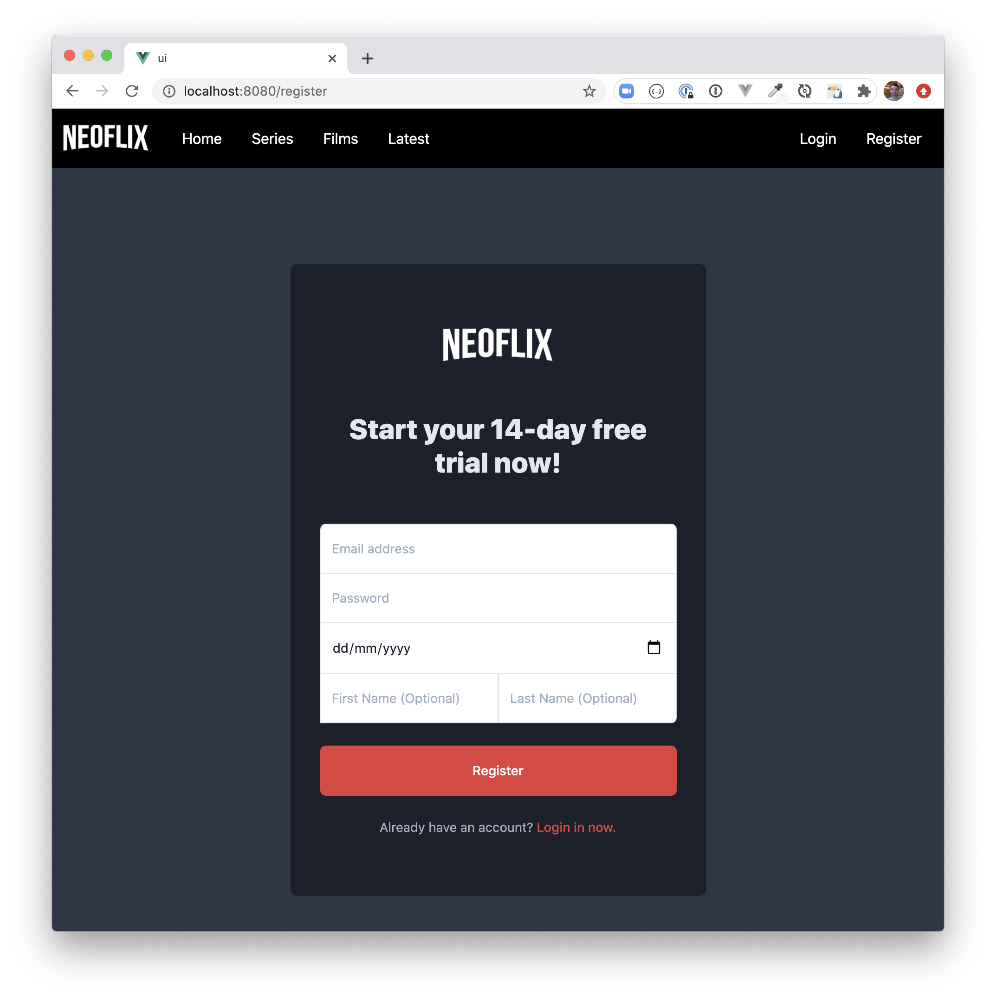

A set of projects written in Node.js, TypeScript, or JavaScript for a fictional Online Streaming Service **Neoflix**.   All of these projects have been created during my weekly Livestream session, **Tuesdays at 13:00 UK time/14:00 Central Europe** on the [Neo4j Twitch Channel](https://twitch.tv/neo4j) and [Neo4j YouTube Channel](https://youtube.com/neo4j).

You can watch the videos back on Youtube in the [Building Web Applications with Neo4j, Nest.js, and Typescript playlist](https://www.youtube.com/playlist?list=PL9Hl4pk2FsvX-Y5-phtnqY4hJaWeocOkq).  Writes up for many of the elements contained in this repository are also available on the [Neo4j Developer Blog](https://medium.com/neo4j).

## Data

All of these projects use the data from the [Neo4j Recommendations Sandbox](https://sandbox.neo4j.com/?usecase=recommendations).  If you would like to try this project out, you can create a [Sandbox](https://sandbox.neo4j.com/) for free which will remain live for 3 days.  You can extend any sandbox project for an additional 7 days.

You can also [download a data dump from Github](https://github.com/neo4j-graph-examples/recommendations) and load it into your local [Neo4j Desktop](https://neo4j.com/download) installation.

## [`api/`](api/)

An API built with [Nest.js](https://nestjs.com) and [nest-neo4j](https://github.com/adam-cowley/nest-neo4j).  Authentication is handled with Passport/Passport JWT.

## [`ui/`](ui/) (WIP)

A UI which calls the API written in [Vue 3](https://vuejs.org) using [Tailwind](https://tailwindcss.com).

API calls are made using the Composition API.

## [`admin/`](/admin) (WIP)

A [Graph App](https://neo4j.com/developer/graph-apps/) built with [React](https://reactjs.org/) and hooks from [use-neo4j](https://github.com/adam-cowley/use-neo4j).  The UI is built with with [Semantic UI](https://semantic-ui.com) components for React.

<!-- ## Tech Stack -->
<!-- See [Tech Stack](./docs/00-tech-stack.md) -->

<!-- ## Sessions

- [Week 1 - Nest fundamentals & Neo4j Integration](./docs/01-nestjs-fundamentals-neo4j-integration.md)
- Week 2
  - [Dynamic Neo4j Configuration](./docs/02-dynamic-configuration.md)
  - [Data Modelling](./docs/03-modelling.md)
  - [Data Import](../data/README.md)
- [Week 3 - Authentication (Registration, Login, JWT tokens)](./docs/04-authentication.md)
- [Week 4 - Authorisation](./docs/05-authorisation.md) -->